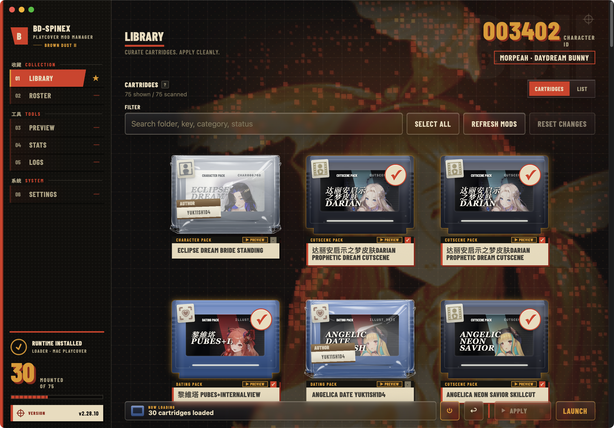
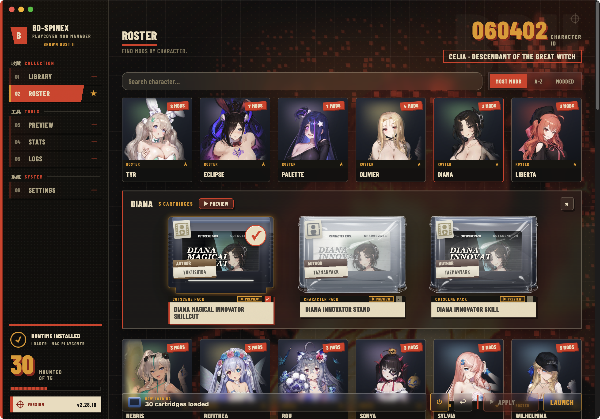
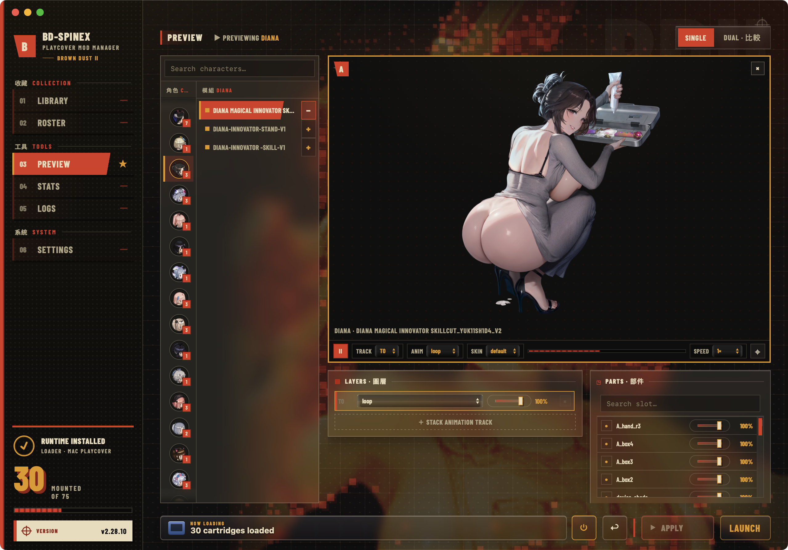

<p align="center">
  
</p>

<h1 align="center">BD-SpineX</h1>

<p align="center">
  <b>The mod manager for <i>BrownDust II</i> on Mac (PlayCover).</b><br>
  Install a loader once, then browse, preview, and swap Spine mods — no AssetBundle editing.
</p>

<!-- Supported game version — auto-updates from the latest GitHub release tag -->
<p align="center">
  <a href="https://github.com/suzumiyahifumi/BD-SpineX/releases/latest">
    
  </a>
</p>
<p align="center">
  <sub>📌 Download the release whose number matches your game version.</sub>
</p>

<p align="center">
  <a href="https://github.com/suzumiyahifumi/BD-SpineX/releases"></a>
  
  <a href="LICENSE"></a>
</p>

<p align="center">
  <a href="https://github.com/suzumiyahifumi/BD-SpineX/releases"><b>⬇️ Download for macOS</b></a>
</p>

<p align="center">
  
</p>

---

## 🎯 Is this for you?

BD-SpineX is for you if…

- ✅ You play **BrownDust II** on **Mac** using **PlayCover**
- ✅ You want to use **Spine costume / skin mods**
- ✅ You want mods that just **load when the game runs** — plug-and-play, like *BrownDustX* on PC

If that sounds like you, you're in the right place. 🙂

> Playing on **Windows**? Check out [BD2ModManager](https://github.com/bruhnn/BD2ModManager) instead — BD-SpineX is Mac + PlayCover only.

---

## 🚀 Quick Start

1. **Download** the latest DMG from [GitHub Releases](https://github.com/suzumiyahifumi/BD-SpineX/releases) and open BD-SpineX.
2. **Choose your Mods Folder** (where you keep your downloaded mods).
3. Click **Install Runtime Injection** — this sets up the loader. *(One time. Re-run it after a game update.)*
4. Click **Refresh Mods** to scan your folder.
5. **Select** the mods you want and click **Apply Changes**.
6. **Launch BrownDust II** and enjoy. 🎮

> [!IMPORTANT]
> Use the BD-SpineX release that **matches your BrownDust II version**, and **close the game** before installing the loader, applying changes, or restoring mods.

---

<div align="center">
<table>
<tr>
<td align="center" width="50%">
<br>
<sub><b>Roster</b> — find mods by character</sub>
</td>
<td align="center" width="50%">
<br>
<sub><b>Preview</b> — see mods animate before installing</sub>
</td>
</tr>
</table>
</div>

---

## 🧩 Requirements

- macOS on **Apple Silicon**
- The **PlayCover** version of **BrownDust II**
- A BD-SpineX release matching your game version

> [!NOTE]
> The app is currently unsigned. On first launch, macOS may ask you to approve it in **System Settings → Privacy & Security**.

---

## 📁 Organizing your mods

Drop your mods anywhere inside your Mods Folder — nested folders are fine. BD-SpineX scans everything for you.

```text
Mods/
  AuthorName/
    Character Costume/
      char123456.skel
      char123456.atlas
      char123456.png

  CollectionName/
    Cutscene Pack/
      illust_dating11.json
      illust_dating11.atlas
      illust_dating11.png
```

Each mod folder usually contains a matching set: `.atlas`, `.png`, and `.skel` or `.json`.

---

## 💡 Why BD-SpineX?

Modding BrownDust II on Mac usually means digging through game files and patching AssetBundles by hand. BD-SpineX replaces all of that with one app:

- **Install once, mods just load.** Set up the loader a single time, and your selected mods load when the game starts.
- **Keep every mod in one place.** Point BD-SpineX at your mods folder and it organizes everything for you.
- **See before you commit.** Preview a mod's animations live, then stage your picks and apply the whole set in one click.
- **Nothing is permanent.** Turn mods off, swap them, or restore the game to clean — your downloaded files are never touched.

---

## 🌐 Where to get mods

Mods are made and shared by the community — BD-SpineX doesn't host any itself. The main hub is the **BrownDustX** community, where modders post their work:

- **BrownDustX Discord** · community mods & discussion → [discord.gg/B3Aqz6tDG2](https://discord.gg/B3Aqz6tDG2)

> [!NOTE]
> These are community spaces run by other people. Follow each server's rules, and only install mods from sources you trust.

---

## 🔗 Related projects

BD-SpineX is built for **Mac + PlayCover**. On another platform, or looking for more tools? These sister projects are worth a look:

- **BrownDustX** · `PC` — the runtime mod framework by Synae that inspired BD-SpineX's loader (shared via the [BrownDustX Discord](https://discord.gg/B3Aqz6tDG2))
- **BD2ModManager** · `WINDOWS` — by bruhnn → [github.com/bruhnn/BD2ModManager](https://github.com/bruhnn/BD2ModManager)
- **browndust2-mod-manager** · `WINDOWS` — by kxdekxde → [github.com/kxdekxde/browndust2-mod-manager](https://github.com/kxdekxde/browndust2-mod-manager)
- **BDroid_X** · `ANDROID` — by Ark-Repoleved → [github.com/Ark-Repoleved/BDroid_X](https://github.com/Ark-Repoleved/BDroid_X)
- **BD2 L2D Viewer** · `WEB` — Live2D model viewer by jelosus2 → [jelosus2.github.io/BD2-L2D-Viewer](https://jelosus2.github.io/BD2-L2D-Viewer)

---

## ❓ FAQ

<details>
<summary><b>Where do I download it?</b></summary>

From [GitHub Releases](https://github.com/suzumiyahifumi/BD-SpineX/releases). Always grab the version that matches your BrownDust II game version.
</details>

<details>
<summary><b>Do I need to close the game to change mods?</b></summary>

Yes. Close BrownDust II before installing/removing the loader, applying changes, using Mod Power, or restoring mods.
</details>

<details>
<summary><b>Will "Restore All" delete my downloaded mods?</b></summary>

No. Restore All only clears mods from the game side. Your source Mods Folder is left untouched.
</details>

<details>
<summary><b>Why are some buttons greyed out?</b></summary>

BD-SpineX locks actions when the game is running, the version doesn't match, the loader isn't installed, the Mods Folder isn't set, or another task is in progress.
</details>

<details>
<summary><b>What do I do after a BrownDust II update?</b></summary>

Download the matching BD-SpineX release, install Runtime Injection again, then re-scan and re-apply your mods.
</details>

<details>
<summary><b>Can I use it on Windows / mobile?</b></summary>

No — BD-SpineX is built for the macOS PlayCover version only. For Windows, see [BD2ModManager](https://github.com/bruhnn/BD2ModManager).
</details>

---

## ❤️ Support & Feedback

Found a bug or have an idea? [Open an issue](https://github.com/suzumiyahifumi/BD-SpineX/issues) — feedback is always welcome. If BD-SpineX makes your modding easier, a ⭐ on the repo means a lot.

---

## 🙏 Credits

- The BrownDust II modding community for testing, feedback, and workflows.
- [BD2ModManager](https://github.com/bruhnn/BD2ModManager) for character metadata and type icons.
- The open-source projects and tools that make Spine modding possible.

---

## 📜 License

BD-SpineX source code is licensed under **GPLv3** — see [LICENSE](LICENSE).
Packaged release builds bundle third-party tools under their own licenses; see [THIRD_PARTY_LICENSES.md](THIRD_PARTY_LICENSES.md) for details.
